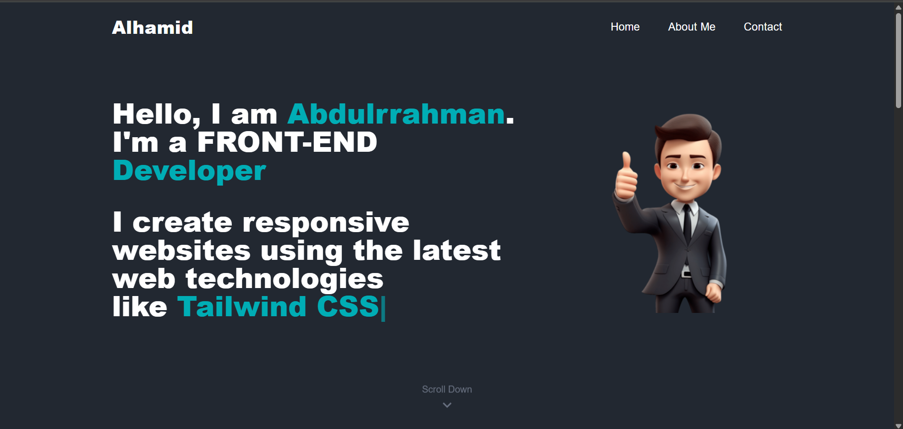

# My Developer Portfolio

Welcome to my personal front-end developer portfolio.  
Built with React, Tailwind CSS, React Icons, and React Retype.  
Deployed using Netlify.

## Features

- Responsive layout for all screen sizes
- Animated hero text using React Retype
- Icons powered by React Icons
- Projects section with image previews and hover animations
- Smooth scroll and section transitions
- Deployed live on Netlify

## Built With

- React
- Tailwind CSS
- React Icons
- React Retype
- Netlify

## Preview



## Live Demo

View the live website: [https://abdulrrahman-portfolio.netlify.app/](https://abdulrrahman-portfolio.netlify.app/)

## Getting Started

To run the project locally:

```bash
git clone https://github.com/abdulrrahmann/my-portfolio.git
cd portfolio
npm install
npm run dev
```
